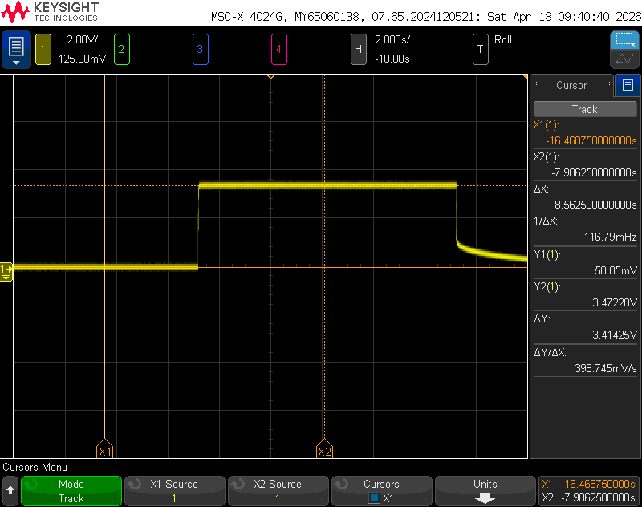
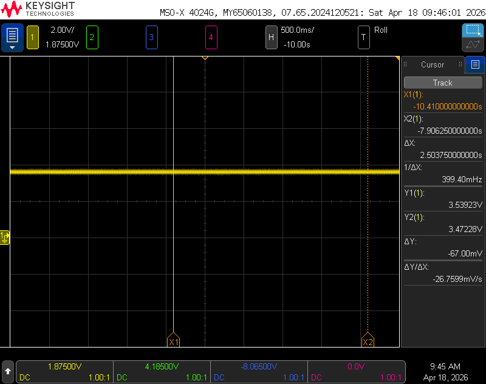
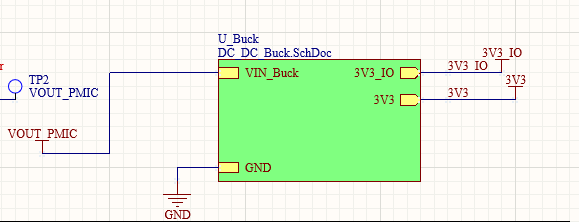
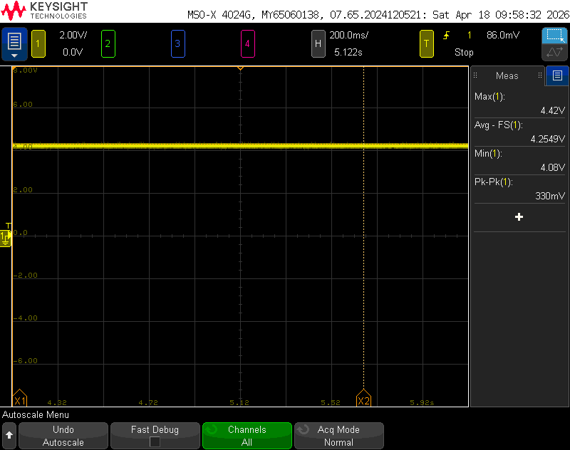
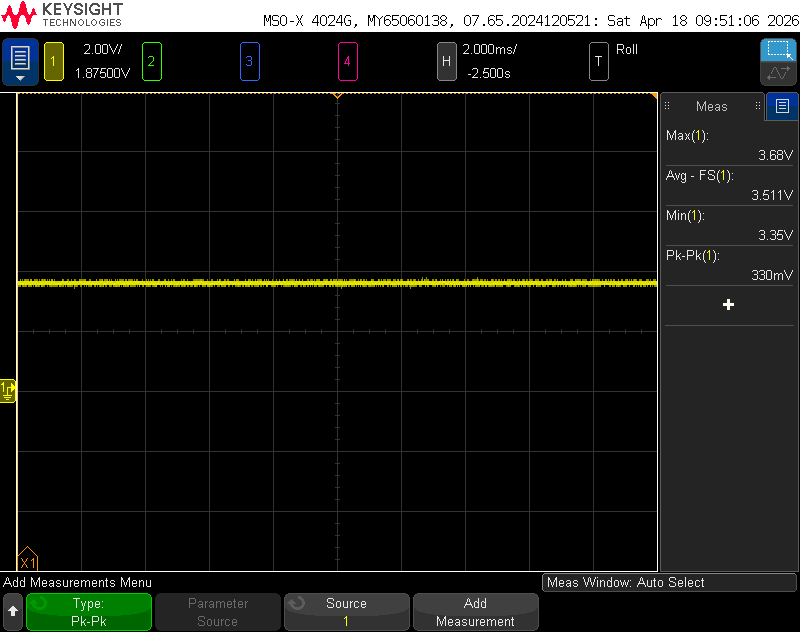
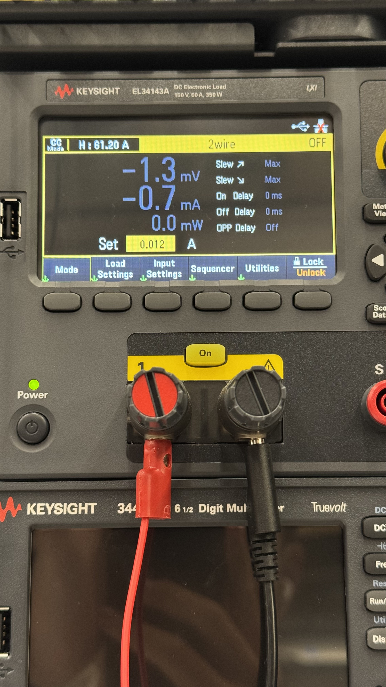
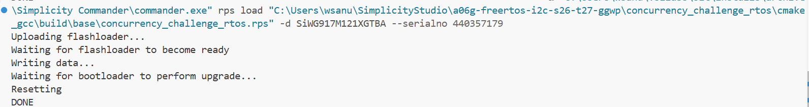

# A07G Board Bringup

- Team Number: T27
- Team Name: GGWP
- Members: Sirui Wu, Shunyao Jiang

## 1. Visual Board Inspection & Photograph

**(1.1) List any issues uncovered in optical inspection.**

| Issues uncovered | Solution |
|------------------|----------|
|Three button not soldering| Re-solder by ourself |

**(1.2) Submit two photos of your PCBA showing the top & bottom views of the PCBA.**

## 2. Power System Evaluation

### 2.1 Distinct Power Modes

**(2.1) Submit a list of your distinct power modes within your PCBA.**

Our system supports the following power modes:

1. Battery-only mode:
   - Input voltage: 3.97V (Li-ion battery)

2. USB-only mode:
   - Input voltage: 5V

3. Battery + USB mode:
   - USB power is prioritized via charging IC
   - The vout_PMIC use USB-c power which is 5V

Regulated voltages:

- Since we mistake the Footprint of IMU IC, somewhere in the peripheral cicuit formed a short circuit. SO we try to connect it to dev board and it works
- The regulated voltage for IMU(dev Board),EMG,Buzzer(output) are 3.17V

### 2.2 Power Regulation Evaluation
  
**(2.2) Submit photos of your PCBA soldered with voltage test wires.**

**(2.3) For each of your power regulation circuits, provide**

**(2.4) In steady state for each supply, measure the following**

Here is out schemactic:

To get our VBAT equal to 4.2V the output current is 40mA.
Under that voltage and current:
The system voltage output is:

And the 3V3 buck output is(3V3_IO = 3V3):

Voltage Measurements

- Average voltage = 3.51V
- Error between expected and actual voltage = 0.21V
- Min voltage = 3.35V
- Max voltage = 3.68V
- Voltage ripple as a percentage of the output voltage = $\frac{V_{ripple}}{V_{out}} \times 100\% = 9.4\% $

**(2.5) Power Evaluation Summary**

The 3.3V buck regulator is able to generate an output voltage close to the expected value; however, the measured average voltage (3.51V) is slightly higher than the nominal 3.3V.

Additionally, the voltage ripple is relatively high (9.4%), which suggests potential issues such as insufficient output filtering, layout-induced noise, or improper grounding.

During debugging, it was discovered that the IMU pins were incorrectly connected, causing a short circuit in the onboard IMU circuitry. To resolve this issue, the faulty connections were bypassed and an external IMU module was connected using fly wires.

This hardware issue may have contributed to the observed instability and elevated ripple.

Overall, while the regulator is functional, the system requires further refinement to improve voltage accuracy and reduce ripple.

### 2.3 Load Testing

In my circuit design, the 3.3V buck regulator represents the component with the highest risk. It is required to supply 800 mA of current to power the EMG, IMU, MCU, and output buzzer, whereas the regulator IC itself has a maximum output capability of 1 A. I will connect a DC power supply to the output of the BQ24075 chip and set the voltage to 4.1 V (which is slightly below the full-charge voltage of a Li-Po battery). Subsequently, I will connect an electronic load to the motor interface. I will then use this electronic load to test the circuit's performance under load conditions of 10%, 50%, 100%, and 120%, recording the corresponding voltage readings in a table.

**(2.6) Photos of E-Load testing setup**

**2.7) A table of expected load with the corresponding voltage as measured by the E-Load.**

| Load (%) | Current (mA) | Measured Voltage (V) |
|----------|-------------|---------------------|
| 10%      | 80 mA      | 3.426 V              |
| 50%      | 400 mA       | 3.28 V              |
| 100%     | 800 mA       | 3.12 V              |
| 120%     | 960 mA       | 3.08 V              |

**(2.8) Analysis**

As the load current increases, the output voltage decreases gradually, which is expected behavior due to load regulation characteristics of the buck converter.

At low load (80 mA), the output voltage is slightly higher than the nominal 3.3V. As the load increases to 800 mA and above, the voltage drops to around 3.1V, indicating noticeable load regulation error.

This suggests that while the regulator is capable of supplying the required current, its regulation performance degrades under higher load conditions. Possible causes include insufficient output capacitance, PCB layout parasitics, or voltage drop across power traces.

Overall, the regulator is functional and capable of supporting the required load, but improvements are needed to enhance voltage stability and reduce load-induced voltage drop.

### 2.4 Thermal Image

## 3. Programming

## 4. Peripheral Evaluation

### 4.1 Debug LED
Will be toggled when the button pressed

### 4.2 Debug Button
Will togger the LED when press

### 4.3 UART Communication
Print "Press!" when the button pressed

### 4.4 I2C Device
Receive the acc data from IMU DEV board.