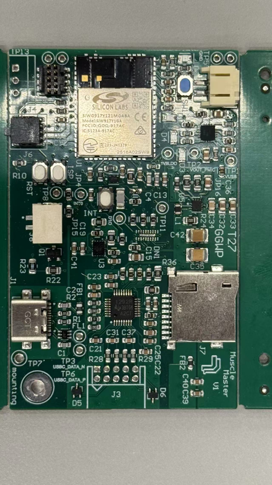
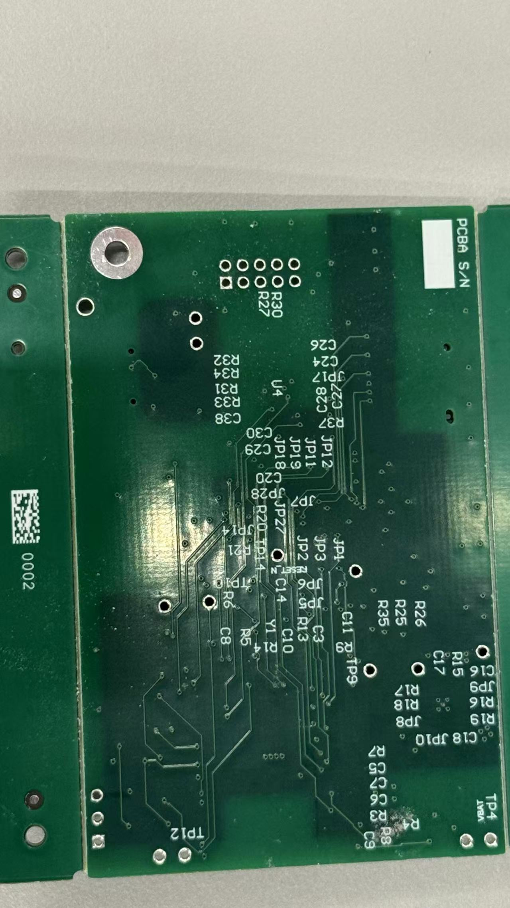

# A07G Board Bringup

- Team Number: T27
- Team Name: GGWP
- Members: Sirui Wu, Shunyao Jiang

## 1. Visual Board Inspection & Photograph

**(1.1) List any issues uncovered in optical inspection.**
| Issues uncovered | Solution |
|------------------|----------|
|Three button not soldering| Re-solder by ourself |

**(1.2) Submit two photos of your PCBA showing the top & bottom views of the PCBA.**

## 2. Power System Evaluation

**(2.1) Submit a list of your distinct power modes within your PCBA.**

Our system supports the following power modes:

1. Battery-only mode:
   - Input voltage: 3.93V (Li-ion battery)

2. USB-only mode:
   - Input voltage: 5V

3. Battery + USB mode:
   - USB power is prioritized via charging IC

Regulated voltages:
- 3.3V rail for MCU, IMU, and EMG
