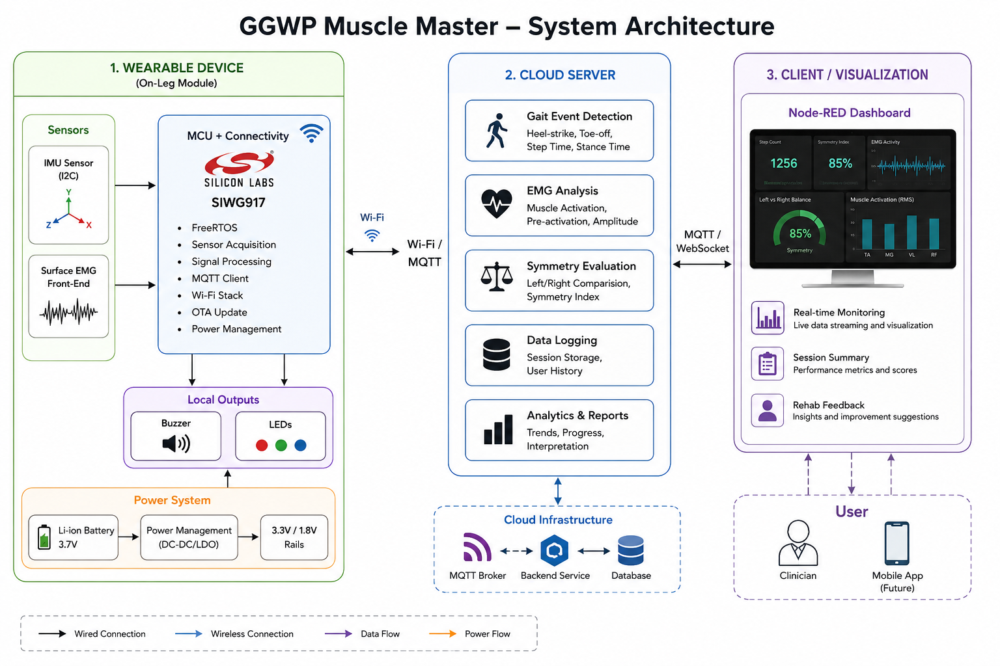
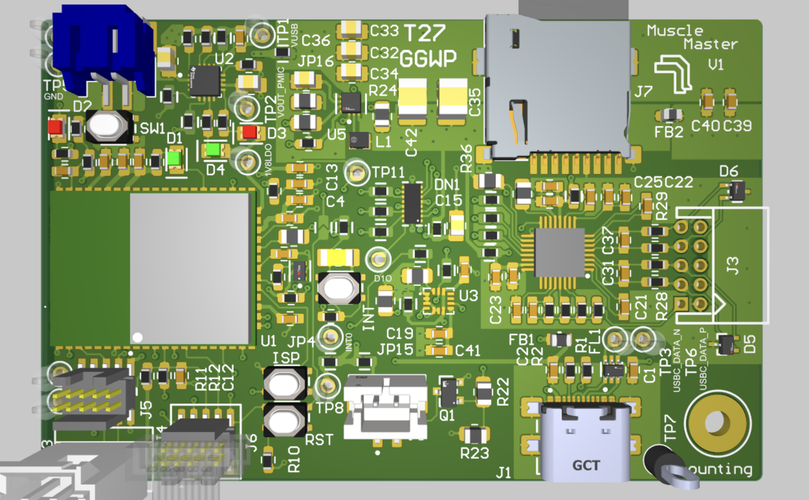

# GGWP Muscle Master

Wearable IoT rehabilitation system for gait symmetry and EMG analysis.

---

## Project Overview

GGWP Muscle Master is a wearable embedded IoT device designed for lower-limb rehabilitation monitoring and gait symmetry evaluation.

The system combines IMU motion sensing and surface EMG acquisition to monitor walking patterns, detect gait asymmetry, and evaluate muscle compensation behavior during rehabilitation exercises.

Sensor data is transmitted through Wi-Fi using MQTT communication, while advanced gait analysis and rehabilitation evaluation are processed on a cloud server.

---

## Features

- IMU gait sensing
- Surface EMG acquisition
- MQTT cloud communication
- OTA firmware update
- Wi-Fi wearable system
- Cloud-based gait analysis
- Buzzer feedback alerts
- Real-time Node-RED visualization

---

## System Overview



---

## PCB Design



---

## Hardware Prototype


---

## Demo

<video src="media/demo/demo.MP4" controls width="800"></video>

---

## Hardware Stack

- Silicon Labs SIWG917Y121MGABA
- IMU Sensor (I2C)
- Surface EMG Front-End
- Buzzer Alert System
- Li-ion Battery Power

---

## Software Stack

- Embedded C
- FreeRTOS
- MQTT
- Wi-Fi
- OTA
- Node-RED
- Cloud Data Processing

---

## Repository Structure

```text
GGWP-Muscle-Master/
│
├── docs/
├── firmware/
├── hardware/
├── cloud/
├── node-red/
├── media/
└── test/
```

---

## Applications

- Rehabilitation monitoring
- Gait symmetry evaluation
- Muscle compensation detection
- Wearable health monitoring

---

## Technologies

- Embedded Systems
- FreeRTOS
- MQTT
- OTA
- IoT
- Wearable Devices
- PCB Design
- Cloud Analytics
- Altium Designer

---

## License

This project is intended for educational and research purposes.
